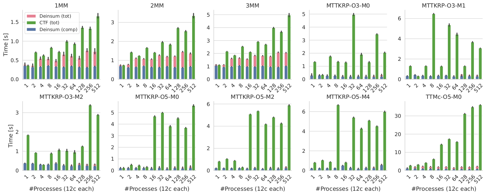
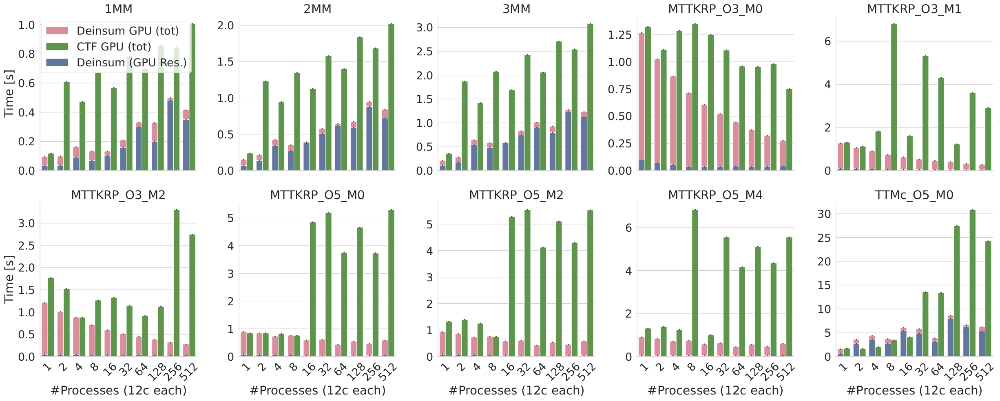

# SC'22 Deinsum Artifact

This repository is the main accompanying artifact for the SC'22 submission "Deinsum: Practically I/O Optimal Multilinear Algebra".

## Submission Summary

The submission describes Deinsum, a Python-based framework for automatically optimizing and executing in distributed-memory machines multilinear algebra kernels expressed in Einstein notation (einsum). Deinsum is evaluated on 10 different kernels and its performance is compared with [Cyclops Tensor Framework's (CTF)](https://github.com/cyclops-community/ctf) on CPU (Fig. 1), and GPU (Fig. 2).

Fig. 1: Deinsum and CTF CPU runtimes on up to 512 nodes. Deinsum’s computation time is also shown as part of the total
runtime.

Fig. 2: Deinsum and CTF GPU runtimes on up to 512 nodes. Deinsum’s runtime with input data resident in global GPU
memory is also shown as part of the total runtime.

## Quickstart

We provide dockerfiles and bash scripts, which can be used to create a docker image, compile all relevant libraries, execute the experiments reported in the paper, and reproduce the figures shown in the paper. Instructions based on docker (https://www.docker.com) follow. However, they should largely hold for other docker-compatible software, e.g., CSCS Sarus (https://user.cscs.ch/tools/containers/sarus).
- [CPU Testing](docker_cpu)
- [GPU Testing](docker_GPU)

## Hardware Requirements

### Submission Testing Setup

The benchmarks shown on the paper were ran on the [Piz Daint supercomputer](https://www.cscs.ch/computers/piz-daint/) using 1-512 Cray XC50 compute nodes. Each Cray XC50 compute node has a 12-core Intel E5-2690 v3 CPU @ 2.6Ghz, an NVIDIA P100 GPU with 16GB of memory, and 64GB of main memory. The nodes are connected through a Cray Aries network using a Dragonfly topology.

### Compatibility

Both Deinsum and CTF use MPI. Therefore, any cluster supporting MPI should be compatible network-wise. Although the network topology should influence performance, it should not affect reproducibility of the results in a qualitative manner. All CPU architectures should in principle work (the provided scripts may need to be significantly adjusted), but the results are only reproducible with Intel CPUs. Only NVIDIA GPU architectures can be used to both test functionality and reproducibility.

<table align="center">
  <tr>
    <th rowspan="2" colspan="2">Architecture</th>
    <th colspan="2">Functional</th>
    <th colspan="2">Reproducible</th>
  <tr>
    <th>Deinsum</th>
    <th>CTF</th>
    <th>Deinsum</th>
    <th>CTF</th>
  </tr> 
  <tr>
    <td rowspan="2">CPU</td>
    <td>Intel</td>
    <td>✔️</td>
    <td>✔️</td>
    <td>✔️</td>
    <td>✔️</td>
  </tr>
  <tr>
    <td>Other</td>
    <td>✔️</td>
    <td>✔️</td>
    <td>❌</td>
    <td>❌</td>
  </tr>
  <tr>
    <td rowspan="2">GPU</td>
    <td>NVIDIA</td>
    <td>✔️</td>
    <td>✔️</td>
    <td>✔️</td>
    <td>✔️</td>
  </tr>
  <tr>
    <td>Other</td>
    <td>❌</td>
    <td>❌</td>
    <td>❌</td>
    <td>❌</td>
  </tr>
</table>

### Guidance

We stronly suggest that the reviewers employ for CPU testing an Intel-based system due a soft requirement on the use of Intel MKL. It is possible for Deinsum to use an alternative BLAS library, e.g., OpenBLAS, in order to test functionality. However, we cannot provide similar support for CTF, as it is third-party software. Regarding GPU testing, we can only support NVIDIA microarchitectures. Furthermore, the GPUs should have at least 16GB of memory to be able to execute the benchmarks with the exact sizes used in the submission.

## Software Requirements

### Submission Testing Setup

The Piz Daint supercomputer runs SUSE Linux Enterprise Server 15 SP2. Deinsum uses the `soap` branch of the [Data-Centric Parallel Programming framework (DaCe)](https://github.com/spcl/dace) (commit ID d096693, may change during AE). For CPU, the latest verified version of CTF was used (commit ID c4f89dc). For GPU, we used CTF's `gpu_devel_v2` branch (commit ID 0c41739b). Generated C++ codes for both Deinsum and CTF were compiled with GCC 9.3.0 and were linked against Cray MPICH (CUDA-aware) 7.7.18, Intel oneAPI MKL 2021.3.0, and CUDA 11.4. Both frameworks utilize the [High-Performance Tensor Transpose Library (HPTT)](https://github.com/springer13/hptt). For Deinsum we used the latest available version (commit ID 9425386), while CTF automatically downloaded and compiled a [forked version](https://github.com/solomonik/hptt) (commit ID 3c77169). Deinsum also uses NVIDIA's cuTENSOR library. We used version 1.5.0.3. Python is needed to run the Deinsum benchmarks. We used version 3.10.2.

### Compatibility

Our benchmarks should execute on any Linux distribution, assuming all relevant tools are available. Deinsum's functionality on CPU should also be verifiable on the Windows Linux Subsystem (WSL). We have not tested Deinsum on Windows and MacOS. DaCe's version/branch currently cannot change. Newer CTF versions should be compatible, at least on CPU. However, for GPU we use a special branch as the main branch currently fails to compile with CUDA. The GCC version is not important as long as it supports C++14 and is compatible with the available CUDA/NVCC version. CUDA version should be at least 10.2, as earlier versions are not suppoted by cuTENSOR. Any recent MPI implementation should work for CPU. For GPU, a CUDA-aware version is mandatory. The versions of Intel MKL, HPTT, and cuTENSOR should not be important. Python version 3.7 or newer is sufficient.

### Guidance

The following guidance matters only if the reviewers do not utilize the provided Docker containers.
We strongly suggest that the reviewers use Python's `venv` module (with the provided scripts) to create a Python virtual environment and avoid module conflicts and incompatibilities. The reviewers may opt to use Anaconda, however, we would like to warn them about potential issues. Anaconda may install its own MPI (MPICH) and Intel MKL libraries, which may in turn conflict with those installed in the system, especially on a cluster/supercomputer. These conflicts may cause discoverability and linking issues with CMake, which is utilized by Deinsum/DaCe to compile auto-generated code. We also suggest that, if possible, MPICH is utilized. If this is not possible and, e.g., OpenMPI, is used instead, the complilation scripts for CTF will have to be adjusted to link to the proper Intel MKL ScaLAPACK libraries (see [Intel Link Advisor](https://www.intel.com/content/www/us/en/developer/tools/oneapi/onemkl-link-line-advisor.html)). For GPU tests, a CUDA-aware MPI implementation is mandatory. Please use the DaCe, CTF, and HPTT versions corresponding to the provided commit IDs. To download cuTENSOR, an NVIDIA developer account is needed.
